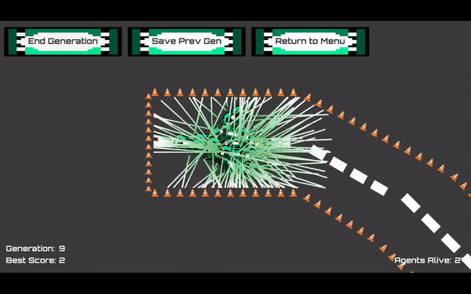
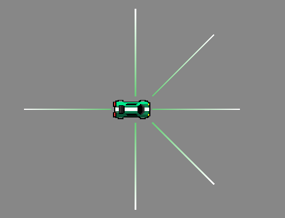
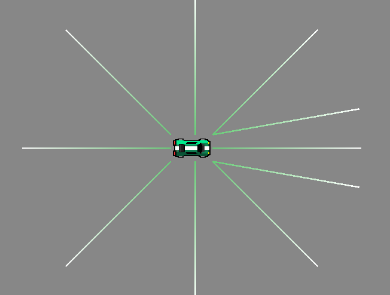

# Unity Neural Network Cars

A Unity project which utilizes a feed forward neural network and a genetic algorithm to teach cars how to navigate both procedurally generated and manually generated racetracks. 

## Demo

## Installation

This project runs in [Unity 2019.4.0f1](https://unity3d.com/get-unity/download/archive). If you'd like to run the simulations in Unity, clone the UnityProject folder and open using Unity. 

An in-browser version of the project can be found [here](https://dp145.itch.io/neural-network-cars), along with links to Windows and Mac builds. 

## Project Overview

The goal is for cars to attempt to navigate the racetrack autonomously without colliding into the walls. There are 6 different pre-built car designs, each with their own array of sensors. 

  

Every simulation starts with the creation of Generation 1, a batch of cars with minimal driving capacity. Each car has an unevolved neural network which dictates the movements of the car. Once all cars inevitably crash (or are eliminated due to inactivity), a genetic algorithm samples the best cars to use as the template for the next generation of cars. Mutations are applied to ensure diversity within the new generation. The process repeats until the maximum generation number of 30 is reached. 

## Neural Network Details

The neural network utilized in this project is a self-implemented feed forward neural network. The network itself is highly customizable, with the only requirements being that the amount of neurons in the input layer match the amount of sensors on the car and that the output layer has two neurons (one for each axis of movement). The number of hidden layers as well as the neurons per layer can be adjusted in the Unity editor. 

Each neural layer is represented as a 2D array of floats, and an array of these layers represents a singular neural network. By default, a basic sigmoid function is used as the activation function, but this can be changed in the [Neural Layer Script](https://github.com/weylanwang/UnitySelfDrivingCar/blob/master/UnityProject/Assets/Scripts/Neural%20Network/NeuralLayer.cs). 

## Genetic Algorithm Details

The genetic algorithm in [Evolution Manager](https://github.com/weylanwang/UnitySelfDrivingCar/blob/master/UnityProject/Assets/Scripts/Managers/EvolutionManager.cs) is responsible for performing evolution on the cars. There are three steps to the evolution process. First, select the cars to be used as templates for the next generation. Second, use recombination to make new cars based off of the templates. Lastly, apply mutation to the cars so that there will be diverse weight values in the neural network such that cars avoid being cordoned off into evolutionary stagnation.

The selection and recombination methods are unified in the Recombination Methods region with 5 options, while there are 3 different mutation methods. Note that  most options are unavailable via the build and have to be changed in the script. 

## Procedural Track Generation

Given the 25 hand-made track pieces, there are currently 2 methods of track generation. The first method involves manually placing track pieces into a scene. 4 manually built tracks of varying difficulty have already been provided in the Prefabs folder under [Track Prefabs](https://github.com/weylanwang/UnitySelfDrivingCar/tree/master/UnityProject/Assets/Prefabs/Track/Track%20Prefabs). The second method involves using a procedural generation algorithm in order to stitch together track pieces in order to create a random  track. 

## Instructions

The section below will explain how to access and navigate the project. 

To view this project, clone this repository and open using the Unity version stated above. Once open, go to the "Scenes" folder and open the "Main Menu" scene. Click the play button at the top of the screen to begin.

#### "Main Menu: Unity Neural Network Cars"
- "New Start" -> Cars will be made without a pre-made Neural Network.
- "Import Save File" -> Cars will be made using a pre-made Neural Network saved from a previous iteration called "saveFile", which can be found in the [Resources Folder](https://github.com/weylanwang/UnitySelfDrivingCar/tree/master/UnityProject/Assets/Resources).

#### "Drive Style"
- "Manually Driven" -> User will drive the car themselves using the arrow keys or WASD.
- "AI Driven" -> Cars will drive learn and drive autonomously.
- "Demo" -> A simulation using a pre-made Neural Network on the extreme track.

#### "Car Selection"
- A menu screen to select the different prebuilt cars to use in the simulation. 

#### "Difficulty"

- "Easy" -> Creates a track using easy pieces.
- "Medium" -> Creates a track using easy and hard pieces.
- "Hard" -> Creates a track using mostly hard pieces.
- "Extreme" -> Loads the preset extreme track.

#### "Track Template"
- "Standard Track" -> Uses the pre-made track for the given difficulty.
- "Randomly Created" -> Builds a track randomly from a given list of pieces based on the difficulty. Note that extreme will default to the prebuilt track to avoid the trackmaker crashing from too many creation attempts.

#### "Algorithm"
- "Best Two Algorithm" -> Uses the Best Two Algorithm when recombining parents for the next generation. Will only use the best two parents and cross their Neural Networks.
- "Roulette Wheel Algorithm" -> Uses the Roulette Wheel Algorithm when recombining parents for the next generation. The better the parent performed, the more likely that their Neural Network will be chosen for the next generation.

#### "Evolution Parameters"

- "Number of Cars" -> Sets the number of cars for each generation.
- "Recombination Chance" -> The likelihood that two weights will be swapped.
- "Mutation Chance" -> The likelihood that a given weight will be modified.
- "Mutation Amount" -> The range that the weight can be modified by (for example, a value of 3 means a mutation range between -3 and 3).

#### Final Screen
- "Start Simulation" -> Will begin the Simulation based on the parameters given to it.

## Contributors
Nam-Giao Nguyen: [LinkedIn](https://www.linkedin.com/in/nam-giao-nguyen-7156981b8/)

Daniel Park: [LinkedIn](https://www.linkedin.com/in/dp145/)

Weylan Wang: [LinkedIn](https://www.linkedin.com/in/weylanwang/)

## License
Please feel free to download, reference, or fork this project for personal use. 
